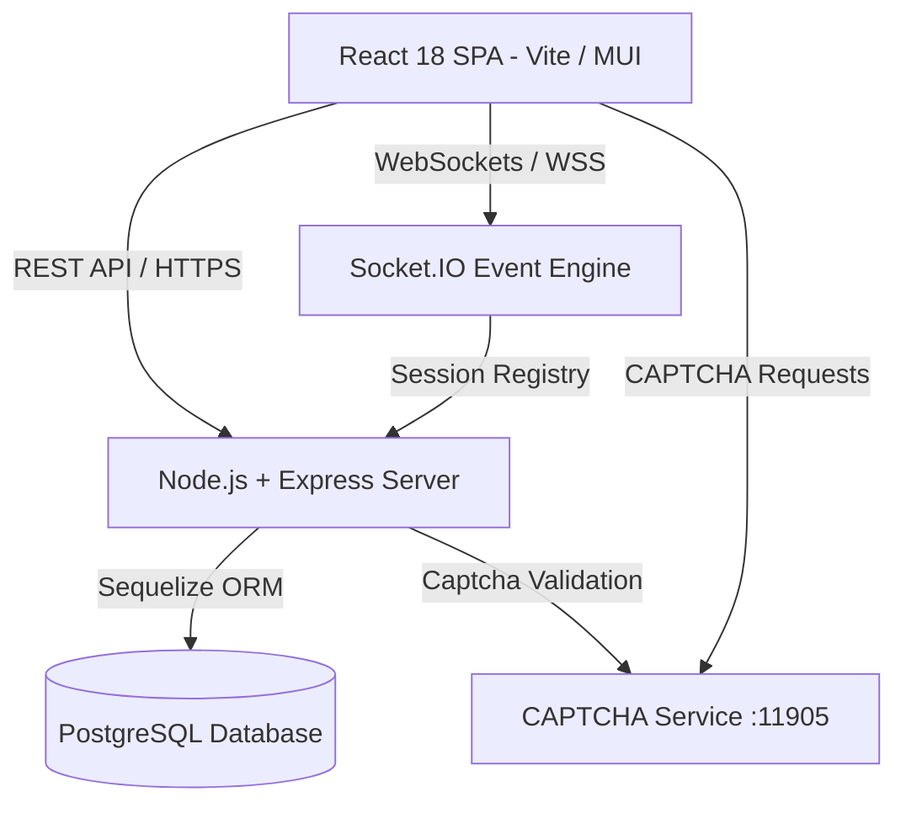
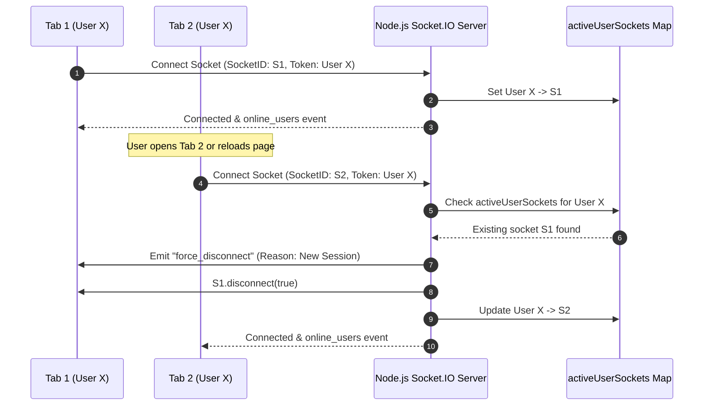
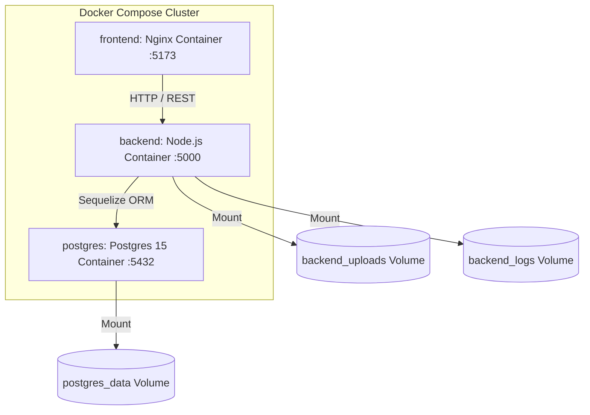

# Software Design Document (SDD)
### IEEE Std 1016-2009 Standard Design Structure

**System Name**: Conversation - Encrypted Real-Time Chat & User Management Platform  
**Document Version**: 1.0.0  
**Date**: October 2026  
**Status**: Final / Approved  

---

## Table of Contents
1. [Introduction](#1-introduction)
   - 1.1 [Purpose](#11-purpose)
   - 1.2 [Scope](#12-scope)
   - 1.3 [Definitions and Acronyms](#13-definitions-and-acronyms)
2. [Architectural Design](#2-architectural-design)
   - 2.1 [System Architecture Overview](#21-system-architecture-overview)
   - 2.2 [Decomposition Description](#22-decomposition-description)
   - 2.3 [Design Rationale](#23-design-rationale)
3. [User Interface Design](#3-user-interface-design)
   - 3.1 [Screen Layouts & Component Catalog](#31-screen-layouts--component-catalog)
4. [Detailed Component Design](#4-detailed-component-design)
   - 4.1 [Database Schemas & Data Models](#41-database-schemas--data-models)
   - 4.2 [Singleton WebSocket Design & Protocol](#42-singleton-websocket-design--protocol)
   - 4.3 [Cryptographic Subsystem Specifications](#43-cryptographic-subsystem-specifications)
5. [Requirements Traceability Matrix](#5-requirements-traceability-matrix)

---

## 1. Introduction

### 1.1 Purpose
This Software Design Document (SDD) describes the system architecture, component decomposition, database schemas, cryptographic mechanisms, sequence flows, and interface contracts for the **Conversation** platform. Adhering to **IEEE Std 1016-2009 standards**, this specification provides comprehensive guidance for software engineers, database administrators, and security auditors.

### 1.2 Scope
This design document applies to the full technical scope of the Conversation application, including the React 18 SPA frontend, Express Node.js backend server, Socket.IO real-time engine, PostgreSQL data layer, and CAPTCHA service integration.

### 1.3 Definitions and Acronyms
- **IEEE 1016**: IEEE Standard for Information Technology — Systems Design — Software Design Descriptions.
- **AES-256**: Advanced Encryption Standard using a 256-bit symmetric key.
- **IV / Auth Tag**: Initialization Vector and Authentication Tag used in AES encryption.
- **ORM**: Object-Relational Mapping (Sequelize).
- **Singleton Socket**: Design pattern restricting WebSocket connection instances to one per user.

---

## 2. Architectural Design

### 2.1 System Architecture Overview
The platform follows a multi-tier client-server topology consisting of Presentation, Application, Security, and Data layers.

### 2.2 Decomposition Description

| Layer / Module | Component | Primary Responsibility |
| :--- | :--- | :--- |
| **Presentation** | React 18 SPA (Vite) | Renders reactive UI, handles user input events, manages component state. |
| **Client State** | AuthContext / UIContext | Manages JWT, user session state, global toast notifications & dialogs. |
| **Client Socket** | SocketService.js | Implements Singleton pattern for WebSocket connection lifecycle. |
| **App Server** | server.js (Node/Express) | Bootstraps HTTP/Socket servers, maintains `activeUserSockets` map. |
| **Auth Controller** | routes/auth.js | Handles registration, login, JWT issuance, profile updates & admin controls. |
| **Chat Controller** | routes/chat.js | Manages message history retrieval and file upload/download encryption streams. |
| **Feedback Module** | routes/feedback.js | Manages user feedback submissions and admin action processing. |
| **Crypto Engine** | utils/encryption.js | Provides AES key derivation, message encryption, and stream ciphers. |
| **Persistence** | PostgreSQL / Sequelize | Stores users, conversations, encrypted messages, files, and feedback. |

### 2.3 Design Rationale
The **Singleton Socket Architecture** ensures that a single user account (`e.g., sgaurav`) maintains only **one active WebSocket connection** across all browser tabs or client devices. When a new connection arrives, the server terminates the pre-existing socket instance (`existingSocket.disconnect(true)`), avoiding conflicting message streams and duplicate notification broadcasts.

---

## 3. User Interface Design

### 3.1 Screen Layouts & Component Catalog
- **Login Component (`Login.jsx`)**: Renders User Login, Admin Login, Signup, Password Visibility toggle, and Adjacent CAPTCHA Box (Image + Audio + Refresh controls).
- **Chat Component (`Chat.jsx`)**: Dual-pane interface with Collapsible Sidebar (logo height 64px, user search bar with clear adornment) and Chat Canvas.
- **UserProfile Component (`UserProfile.jsx`)**: Edit profile dialog for updating display name and password with mandatory CAPTCHA validation.
- **AdminPanel Component (`AdminPanel.jsx`)**: `material-react-table` interface displaying user rows, lock status chips, action menus, and feedback management tab.
- **AppFooter Component (`Footer.jsx`)**: Modular footer component displaying dynamic copyright year and maintainer info.

---

## 4. Detailed Component Design

### 4.1 Database Schemas & Data Models

#### 4.1.1 Users Schema (`users`)
| Field Name | Type | Constraints | Description |
| :--- | :--- | :--- | :--- |
| `id` | INTEGER | PK, Auto Increment | Unique user ID |
| `username` | VARCHAR(32) | Unique, Not Null | Login handle |
| `password_hash` | VARCHAR(255) | Not Null | Bcrypt password hash |
| `name` | VARCHAR(32) | Nullable | Display name |
| `email` | VARCHAR(255) | Nullable | User email address (validated domain) |
| `profile_photo` | VARCHAR(255) | Nullable | Server path to uploaded profile photo |
| `sex` | ENUM | `'male'`, `'female'`, `'tgp'`, Nullable | User sex identity |
| `role` | VARCHAR(16) | Default `'user'` | Role (`'user'` or `'admin'`) |
| `is_active` | BOOLEAN | Default `true` | Account activation flag |
| `is_locked` | BOOLEAN | Default `false` | Security lockout flag |
| `failed_attempts`| INTEGER | Default `0` | Failed password attempt counter |
| `created_at` | TIMESTAMP | Not Null | Account creation timestamp |

#### 4.1.2 Email Client Master Schema (`email_client_masters`)
| Field Name | Type | Constraints | Description |
| :--- | :--- | :--- | :--- |
| `id` | INTEGER | PK, Auto Increment | Unique email client ID |
| `domain` | VARCHAR(255) | Unique, Not Null | Allowed domain string (e.g. `gmail.com`) |
| `is_active` | BOOLEAN | Default `true` | Active domain status toggle |
| `created_at` | TIMESTAMP | Not Null | Creation timestamp |
| `updated_at` | TIMESTAMP | Not Null | Last update timestamp |

#### 4.1.3 Coding Language Master Schema (`coding_language_masters`)
| Field Name | Type | Constraints | Description |
| :--- | :--- | :--- | :--- |
| `id` | INTEGER | PK, Auto Increment | Unique coding language ID |
| `name` | VARCHAR(255) | Not Null | Display name (e.g. `JavaScript`) |
| `value` | VARCHAR(255) | Unique, Not Null | Syntax identifier (e.g. `javascript`) |
| `is_active` | BOOLEAN | Default `true` | Active status toggle |
| `created_at` | TIMESTAMP | Not Null | Creation timestamp |
| `updated_at` | TIMESTAMP | Not Null | Last update timestamp |

#### 4.1.4 Conversations Schema (`conversations`)
| Field Name | Type | Constraints | Description |
| :--- | :--- | :--- | :--- |
| `id` | INTEGER | PK, Auto Increment | Conversation ID |
| `user1_id` | INTEGER | FK -> Users.id | First participant ID |
| `user2_id` | INTEGER | FK -> Users.id | Second participant ID |
| `encrypted_chat_key` | TEXT | Not Null | Encrypted master key |
| `key_iv` | VARCHAR(64) | Not Null | Master key IV |
| `key_auth_tag` | VARCHAR(64) | Not Null | Master key auth tag |

#### 4.1.4 Messages Schema (`messages`)
| Field Name | Type | Constraints | Description |
| :--- | :--- | :--- | :--- |
| `id` | INTEGER | PK, Auto Increment | Message ID |
| `conversation_id`| INTEGER | FK -> Conversations.id | Conversation ID |
| `sender_id` | INTEGER | FK -> Users.id | Sender ID |
| `encrypted_content`| TEXT | Not Null | AES encrypted message text |
| `iv` | VARCHAR(64) | Not Null | Cipher IV |
| `auth_tag` | VARCHAR(64) | Not Null | Cipher auth tag |
| `is_read` | BOOLEAN | Default `false` | Read receipt flag |

---

### 4.2 Singleton WebSocket Design & Protocol

---

### 4.3 Cryptographic Subsystem Specifications
1. **Master Key Derivation**: Server derives conversation master key using `SERVER_MASTER_KEY` and conversation `key_iv`.
2. **AES Payload Encryption**: `encryptMessage(plainText, chatKey)` returns `{ encryptedContent, iv, authTag }`.
3. **AES Payload Decryption**: `decryptMessage(cipherText, iv, authTag, chatKey)` returns plain text.
4. **Magic Byte Image Inspection**: `validateImageMagicBytes(buffer)` inspects initial 4 header bytes (`0xFF 0xD8 0xFF` for JPEG, `0x89 0x50 0x4E 0x47` for PNG) preventing content-type spoofing.

---

## 5. Requirements Traceability Matrix

### 4.4 Container Orchestration & Persistent Volume Architecture
The system utilizes **Docker Compose** (`docker-compose.yml`) for multi-container orchestration across 3 isolated services:
1. **`postgres`**: PostgreSQL 15 Database container.
2. **`backend`**: Node.js Express & Socket.IO server container with dependency on PostgreSQL health checks.
3. **`frontend`**: Production multi-stage Nginx container serving compiled React SPA assets.

#### Persistent Storage Volume Mapping
- **`postgres_data`**: Mapped to `/var/lib/postgresql/data` for database persistence.
- **`backend_uploads`**: Mapped to `/app/uploads` for encrypted attachment files and profile pictures.
- **`backend_logs`**: Mapped to `/app/logs` for persistent storage of Winston log files.

---

### 4.5 Winston Logging Subsystem Specifications
1. **Module Location**: `backend/utils/logger.js`.
2. **Target File Path**: `backend/logs` directory.
3. **Transports Configured**:
   - `transports.Console`: Colorized timestamped logs for container stdout.
   - `transports.File (combined.log)`: Complete JSON structured logs (Max Size: 10MB, Max Files: 10).
   - `transports.File (error.log)`: Dedicated error logs with exception stack traces (Max Size: 5MB, Max Files: 5).
4. **HTTP Interceptor**: Express middleware measuring request latency (`res.on('finish')`) and logging HTTP status, duration, and client IP.

---

## 5. Requirements Traceability Matrix

| SRS Req ID | Feature Area | SDD Component / Module | Verification Method |
| :--- | :--- | :--- | :--- |
| **FR-1.1** | User Registration | `routes/auth.js` -> `/register` | Integration Test |
| **FR-1.2** | CAPTCHA Check | `Login.jsx` / `auth.js` -> `validateCaptcha()` | Functional Test |
| **FR-1.3** | Audio CAPTCHA | `Login.jsx` -> `handlePlayAudioCaptcha()` | UI Test |
| **FR-1.4** | Account Lockout | `auth.js` -> login controller | Unit Test |
| **FR-2.1** | Profile Update | `UserProfile.jsx` / `auth.js` -> `PUT /profile` | UI / Integration Test |
| **FR-2.2** | Profile Photo | `FileUploader.jsx` / `auth.js` -> Magic Bytes Inspection | Cryptographic / Binary Validation |
| **FR-2.3** | Email Client Domain | `UserProfile.jsx` -> Autocomplete / `auth.js` | Integration Test |
| **FR-2.4** | Sex Selection | `UserProfile.jsx` -> Select Dropdown | UI Test |
| **FR-3.1** | Private Chat | `Chat.jsx` / `server.js` -> `join_conversation` | Socket Event Test |
| **FR-3.2** | E2E Encryption | `utils/encryption.js` -> AES Cipher | Cryptographic Unit Test |
| **FR-3.3** | Singleton Socket | `socketService.js` / `server.js` -> `activeUserSockets` | Concurrent Session Test |
| **FR-3.4** | URL Sharing | `UrlShareModal.jsx` / `ChatInput.jsx` / `FormattedMessage.jsx` | UI / Integration Test |
| **FR-4.1** | File Attachment | `routes/chat.js` -> `POST /files/:convId` | Integration Test |
| **FR-6.1** | Admin Governance | `AdminPanel.jsx` / `auth.js` -> `/admin/users` | Role Authorization Test |
| **FR-6.2** | Email Client Master | `SystemMasters.jsx`, `EmailClientMaster.jsx`, `AddEmailClientDialog.jsx` | Integration Test |
| **FR-6.3** | Coding Languages Master | `SystemMasters.jsx`, `CodingLanguageMaster.jsx`, `AddCodingLanguageDialog.jsx`, `CodeSnippetModal.jsx` | Integration Test |
| **FR-7.1** | Feedback Subsystem | `FeedbackDialog.jsx` / `routes/feedback.js` | Integration Test |
| **FR-8.1** | Docker Orchestration | `docker-compose.yml`, `backend/Dockerfile`, `frontend/Dockerfile` | Containerization Test |
| **FR-8.2** | Winston Logger | `backend/utils/logger.js` -> `backend/logs/combined.log`, `error.log` | Audit Log Validation |
